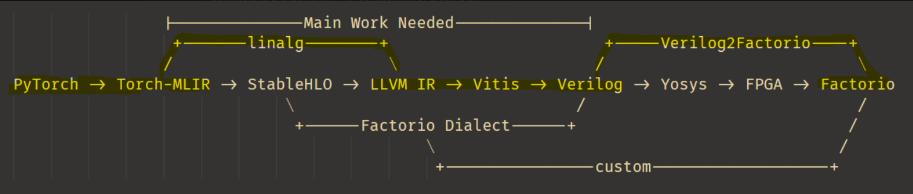
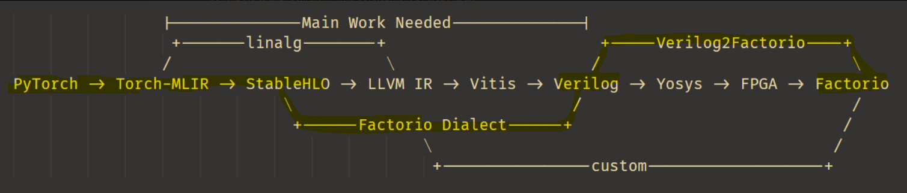
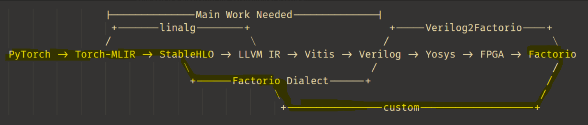

# Notes

```txt
                |--------------Main Work Needed--------------|
                 +-------linalg--------+                       +-----Verilog2Factorio----+
                /                       \                     /                           \
PyTorch -> Torch-MLIR -> StableHLO -> LLVM IR -> Vitis -> Verilog -> Yosys -> FPGA -> Factorio
                             \                              /                             /
                              +------Factorio Dialect------+                             /
                                            \                                           /
                                             +----------------custom-------------------+
```

### Plan 1:



### Plan 2:



### Plan 3:



```cpp
/**
 * 1. linalg-on-tensors:
 *    - The linalg-on-tensors dialect provides a set of operations for expressing linear algebra computations
 *      (such as matrix multiplication, convolution, etc.) on tensor data structures. It is designed to be
 *      hardware-agnostic and serves as a high-level abstraction for optimizing and lowering linear algebra
 *      operations to more hardware-specific representations.
 *
 * 2. stablehlo:
 *    - The stablehlo (Stable High-Level Operations) dialect is a stable, portable, and versioned set of
 *      operations that closely mirror the XLA HLO (High-Level Optimizer) operations. It is intended for
 *      representing machine learning computations in a way that is both backend-agnostic and suitable for
 *      interoperability between different ML frameworks and compilers.
 *
 * 3. torch:
 *    - The torch dialect provides an MLIR representation of PyTorch operations. It enables the conversion
 *      and optimization of PyTorch models within the MLIR ecosystem, facilitating analysis, transformation,
 *      and lowering of PyTorch programs to other dialects or hardware targets.
 *
 * 4. tosa:
 *    - The tosa (Tensor Operator Set Architecture) dialect defines a standardized set of tensor operations
 *      for machine learning workloads. It is designed to be a portable and target-independent intermediate
 *      representation, enabling efficient mapping of ML models to a wide range of hardware accelerators.
 */
```
